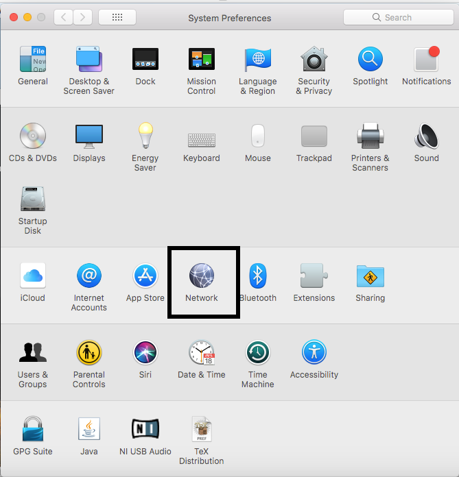
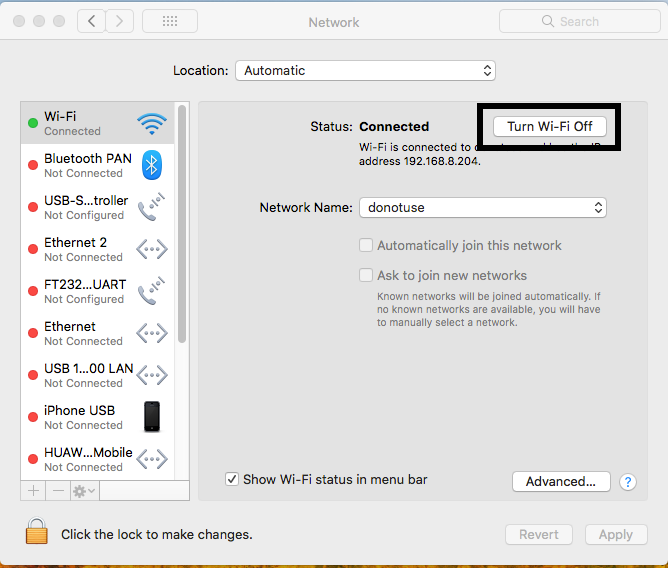
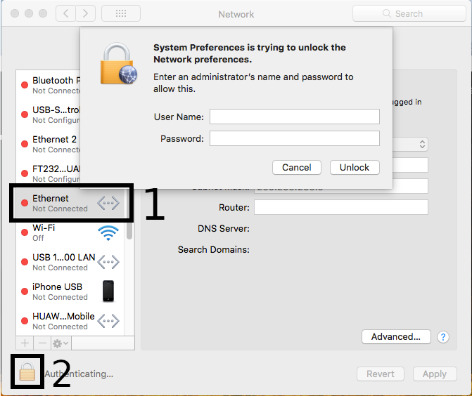
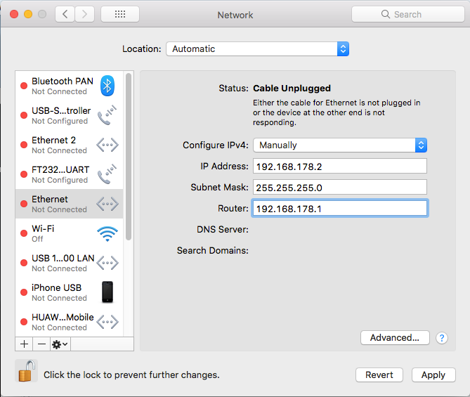
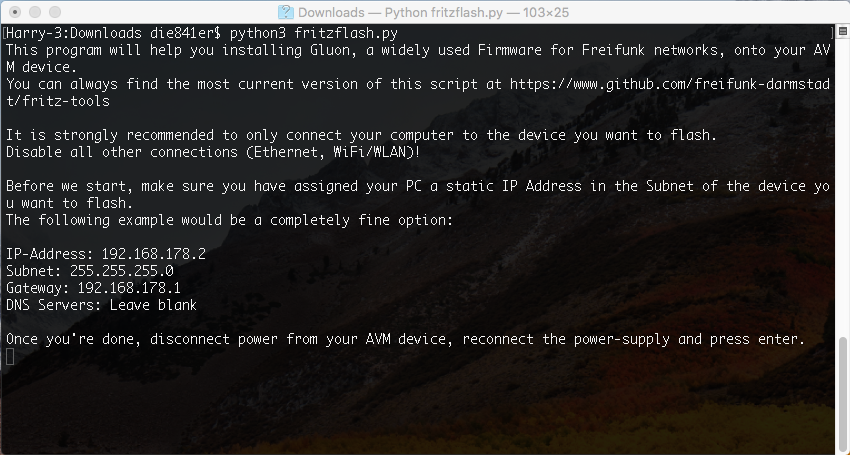
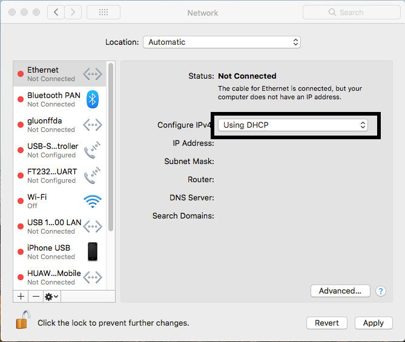

Flash Gluon using MacOS X
=========================

Your router can be flashed in a few easy step from MacOS X.

Preperation
-----------

To execute the fritzflash.py script you need to have Python 3 installed. You can obtain the latest version from the Python project here_.

.. _here: https://www.python.org/downloads/mac-osx/

You also need to download the image for your device from your local Freifunk community. This is important to make right now as you will have no ability to do so later on.

Download the flash-script
-------------------------

Open a terminal by pressing cmd+Space.

Next, go to the directory you saved the Image you downloaded in the preperation step. In most cases this is done by èxecuting ``cd Downloads``.

Now you want to download the script by executing ``curl -O https://raw.githubusercontent.com/freifunk-darmstadt/fritz-tools/master/fritzflash.py``.

Confirm both the Gluon image you want to flash and the script are present in the current directory by executing ``ls``.

.. image:: macos_step_1.png

Keep the Terminal window open.

Configuring a static IP-address
-------------------------------

Open ``System Preferences`` and select ``Network``.

Make sure to disable your Wireless connection now.

Select ``Ethernet`` from the left menu and in case input fields are grayed out, unlock settings by clicking on the Lock in the bottom left corner.

Configure your settings as seen in following screenshot and confirm by clicking on ``Apply``. Keep the window opened.

Install Gluon
-------------

Connect the router with your computer. In case it has multiple ports, use the yellow LAN-ports.

Execute the flash-script by executing ``python3 fritzflash.py`` in the Terminal window you left open.

In case you're asked to allow incoming connection or not select ``Allow``.

.. image:: macos_step_7.png

Revert network settings
-----------------------

Before you are able to reach the Config-mode of your new node you have to reconfigure your network interface to automatically obtain an IP-address using DHCP.

Configure your ``Ethernet`` interface as pictured on the screenshot below and confirm by selecting ``Apply``.

