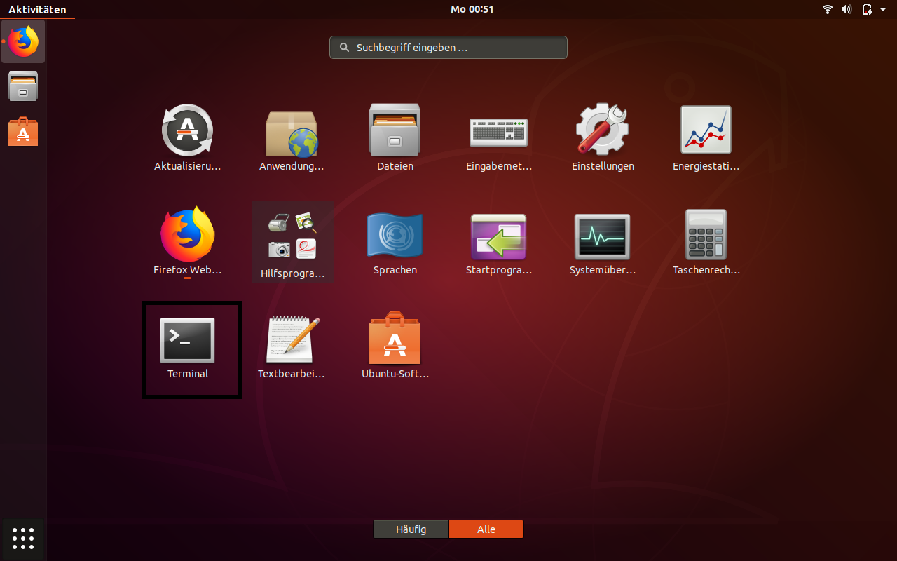
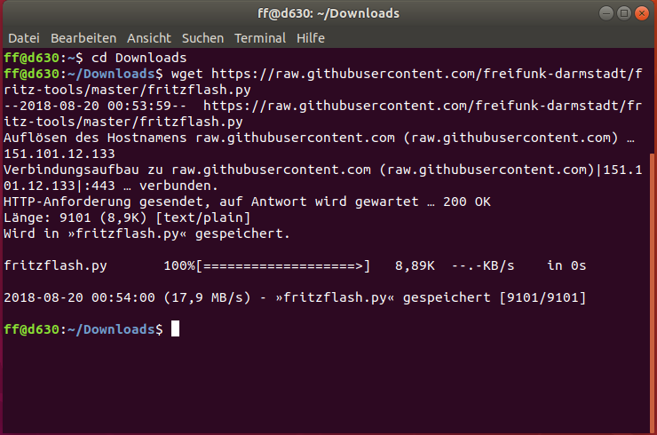
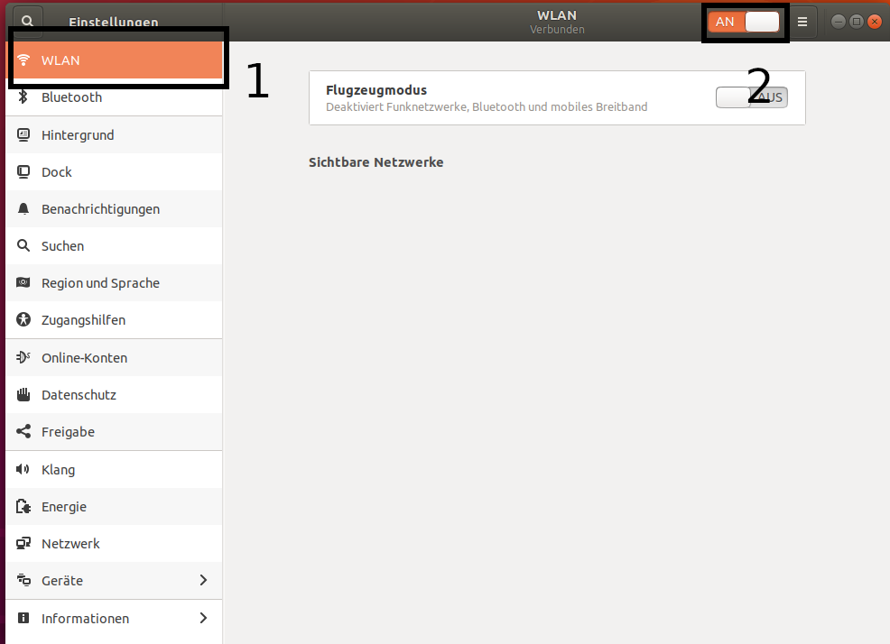
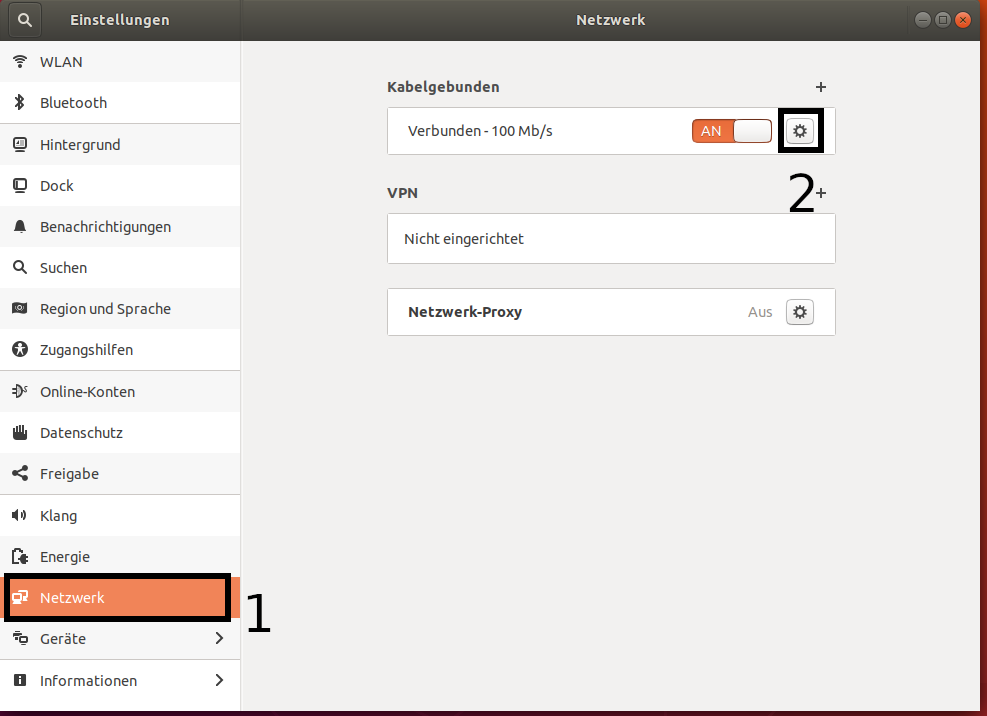
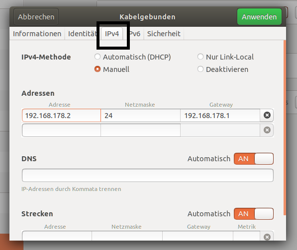
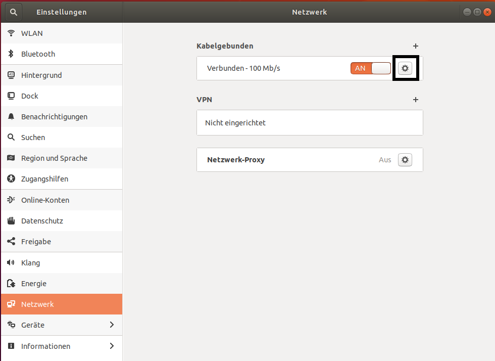
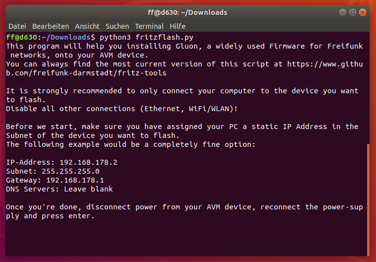
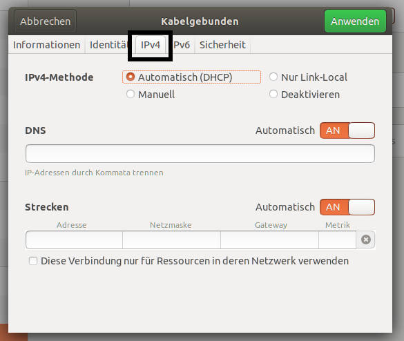

Flash Gluon using Ubuntu 18.04
==============================

Your router can be flashed in a few easy step from Ubuntu 18.04.

Preperation
-----------

First you need to download the image for your device from your local Freifunk community. This is important to do right now as you will have no ability to do so later on.

Download the flash-script
-------------------------

Open a terminal by pressing ``Ctrl+Alt+T`` or open the application-drawer (bottom left) and search for Terminal.

Next, go to the directory you saved the image you downloaded in the preperation step. In most cases this is done by executing ``cd Downloads``.

Now you want to download the script by executing ``wget https://raw.githubusercontent.com/freifunk-darmstadt/fritz-tools/master/fritzflash.py``.

Confirm both the Gluon image you want to flash and the script are present in the current directory by executing ``ls``.

Keep the Terminal window open.

Configuring a static IP-address
-------------------------------

Open the settings application.

If your computer has WiFi, make sure to disable it now.

Select ``Network`` from the left menu and open the settings by clicking on the gear button.

Configure your Settings as seen in the following screenshot and confirm by clicking on ``Apply`` in the top right corner.

Now you will need to deactivate and reactivate the network interface to correctly apply the settings. Do so by turning the connection from On to Off. Wait two seconds and turn the connection back On again.

Keep the settings window open.

Install Gluon
-------------

Connect the router with your computer. In case it has multiple ports, use the yellow LAN-ports.

Execute the flash-script by executing ``python3 fritzflash.py`` in the Terminal window you left open.

Revert network settings
-----------------------

Before you are able to reach the Config-mode of your new node you have to reconfigure your network interface to automatically obtain an IP-address using DHCP.

Configure your network interface interface as pictured on the screenshot below and confirm by selecting ``Apply``.

You will (again) need to deactivate and reactivate the Network interface to correctly apply the settings. Do so by turning the connection from On to Off. Wait two seconds and turn the connection back On again.

