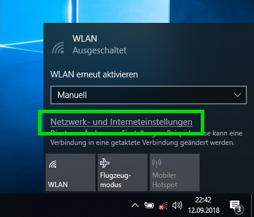
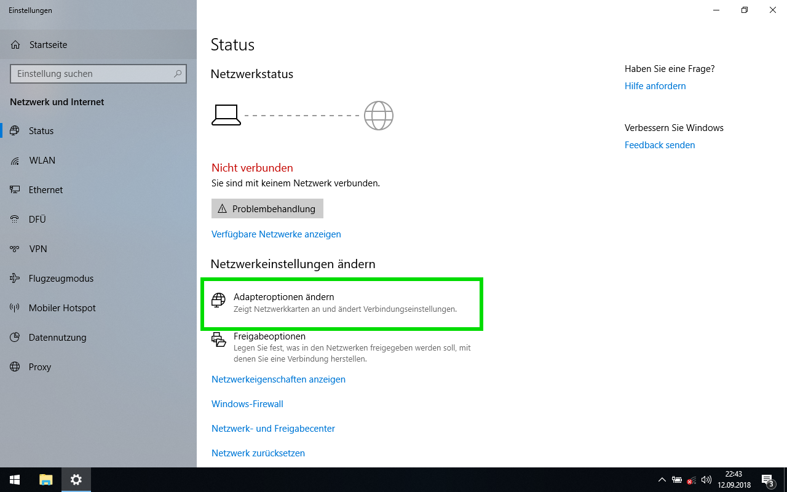
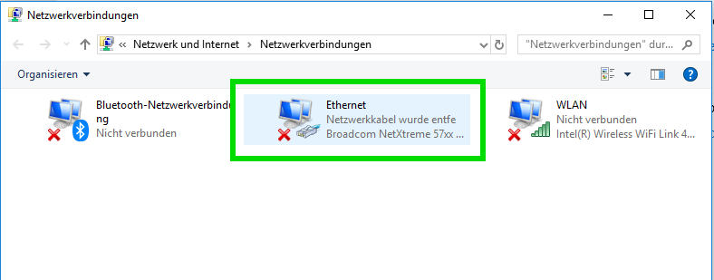
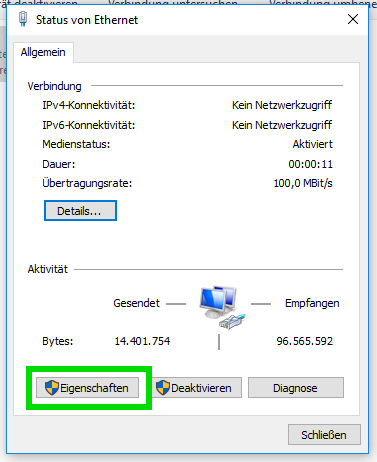
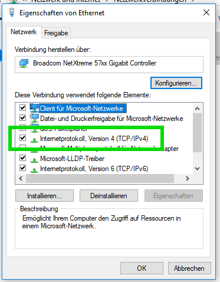
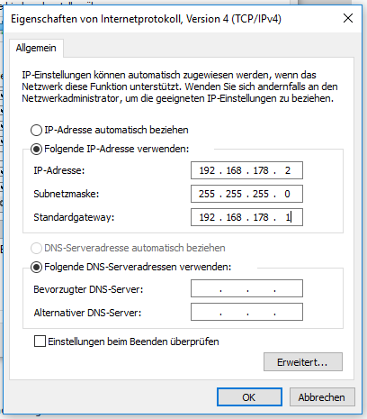
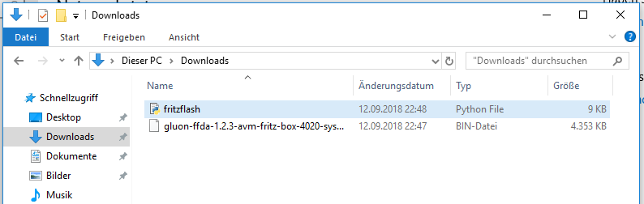
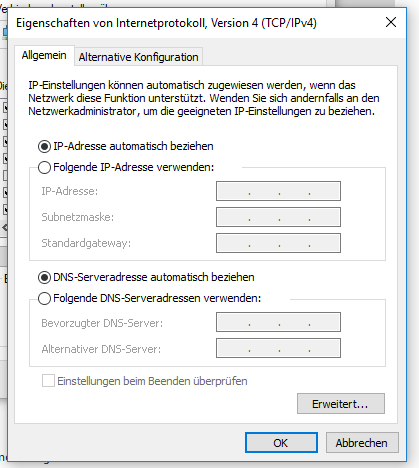

Flash Gluon using Windows 10
============================

Your router can be flashed in a few easy step from Windows 10.

Preperation
-----------

First you need to download the image for your device from your local Freifunk community. This is important to do right now as you will have no ability to do so later on.

Download Python 3 for Windows
-----------------------------

Download and install the latest version of Python 3. It can be obtained from the website_ of the Python project.

.. _website: https://www.python.org/downloads/

Download the flash-script
-------------------------

Download the latest version of the flash-script ``fritzflash.py`` at the link below. In case you are prompted whether you want to save or open this file, select save.

fritzflash.py_

.. _fritzflash.py: https://github.com/freifunk-darmstadt/fritz-tools/releases

Disable WiFi
------------

In case your computer is connected via WiFi, make sure to disable this connection by opening the Quick-settings in the lower right corner. Make sure WiFi is disabled there.

.. image:: windows10_step_1.png

Configuring a static IP-address
-------------------------------

Open the network settings by opening Quick-settings and navigate to the ``Network and Sharing Center.``

Go to the ``Network Adapter Settings``.

Select the adapter called ``Ethernet``.

In the adapter-status window, select properties.

Double-click on ``Internet Protocol Version 4``.

Fill out all fields as seen on the image below. Close afterwards both windows by clicking ``OK``.

Install Gluon
-------------

Now move both fritzflash.py and the Gluon image in an empty directory.

.. Note:: It is important both files are located in the same directory. Otherwise the process won't work.

Connect the router with your computer. In case it has multiple ports, use the yellow LAN-ports.

Execute the flash-script by double-clicking on ``fritzflash.py``.

In case Windows Firewall asks you whether you want to allow or deny network activity, select ``Allow``.

.. image:: windows10_step_8.png

Revert network settings
-----------------------

Before you are able to reach the Config-mode of your new node you have to reconfigure your network interface to automatically obtain an IP-address using DHCP.

Configure your network interface interface as pictured on the screenshot below and confirm by selecting ``OK`` in both windows.

Also remember to turn on your WiFi again.
